# BLX stealer detection and response using Wazuh

## Windows endpoint

1. Download sysmon from the https://learn.microsoft.com/en-us/sysinternals/downloads/sysmon

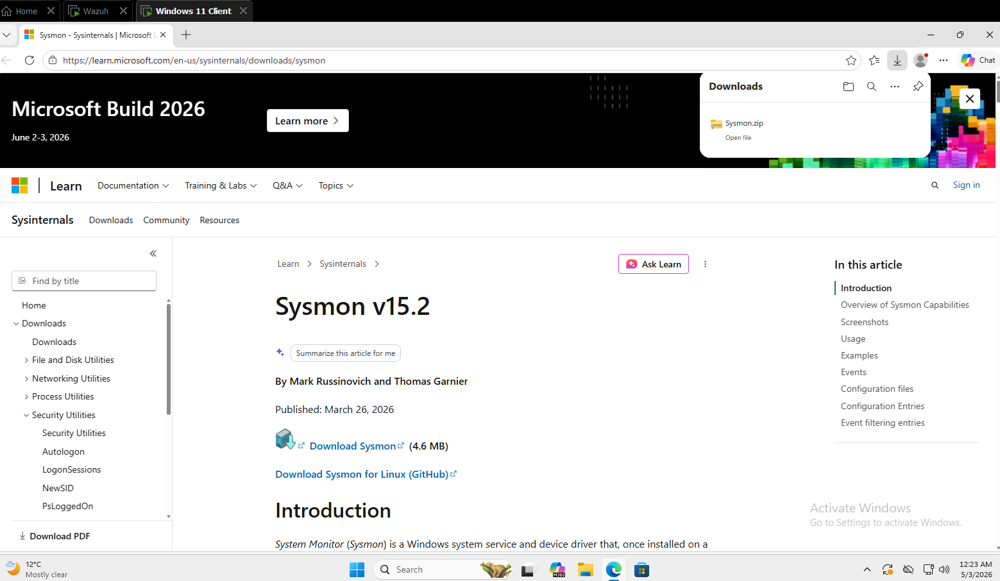

2. Using Powershell with administrator privilege, create a `Sysmon` folder in the endpoint `C:\` folder

```powershell
New-Item -ItemType Directory -Path C:\Sysmon
```

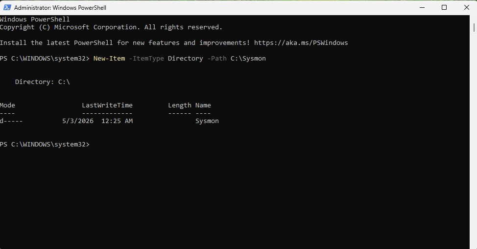

3. Extract the compressed Sysmon file to the folder created above `C:\Sysmon`:

```powershell
Expand-Archive -Path "C:\Users\Elchin Guliyev\Downloads\Sysmon.zip" -DestinationPath "C:\Sysmon"
```

> \*Note: Replace the “**C:\Users\Elchin Guliyev\Downloads\*\*” with the path where **Sysmon.zip\*_ was downloaded._

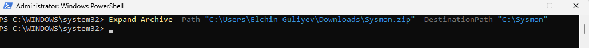

4. Download the Sysmon configuration file – [sysmonconfig.xml](sysmon-configuration/sysmonconfig.xml) (or from [sysmonconfig.xml](https://wazuh.com/resources/blog/emulation-of-attack-techniques-and-detection-with-wazuh/sysmonconfig.xml)) to `C:\Sysmon`

```powershell
wget -Uri https://wazuh.com/resources/blog/emulation-of-attack-techniques-and-detection-with-wazuh/sysmonconfig.xml -OutFile C:\Sysmon\sysmonconfig.xml
```

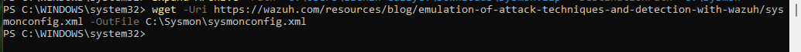

5. Switch to the directory with the Sysmon executable and run the command to install and start Sysmon using PowerShell with administrator privileges

```powershell
cd C:\Sysmon
.\Sysmon64.exe -accepteula -i sysmonconfig.xml
```

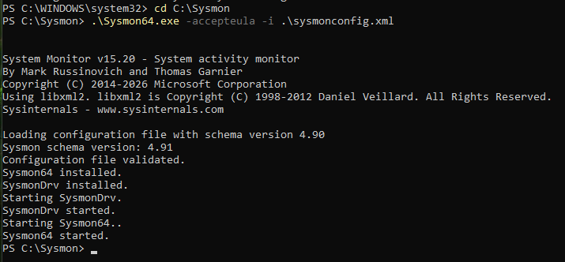

6. Add the following configuration within the `<ossec_config>` block of the `C:\Program Files (x86)\ossec-agent\ossec.conf` file:

```xml
<localfile>
  <location>Microsoft-Windows-Sysmon/Operational</location>
  <log_format>eventchannel</log_format>
</localfile>
```

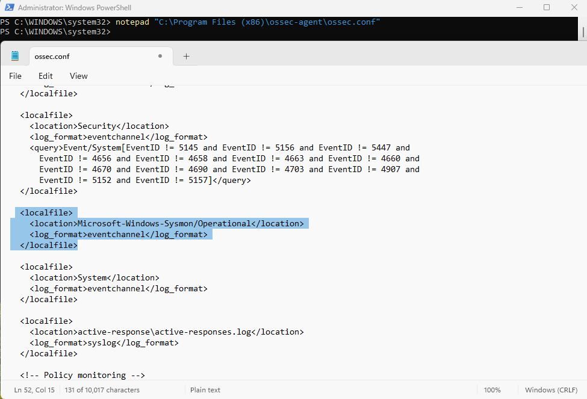

7. Restart the Wazuh agent to apply the configuration changes by running the following PowerShell command as an administrator:

```powershell
Restart-Service -Name wazuh
```

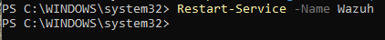

## Wazuh server

1. Create a new file `/var/ossec/etc/rules/blx_stealer.xml`

```bash
touch /var/ossec/etc/rules/blx_stealer.xml
```

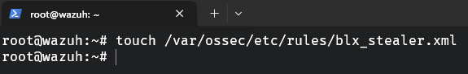

2. Edit the file `/var/ossec/etc/rules/blx_stealer.xml` and include the following detection rules for BLX stealer:

```xml
<group name="windows,sysmon,blx_stealer,">

  <!-- 1. Dropping temp.ps1 script -->
  <rule id="100300" level="10">
    <if_sid>92213</if_sid>   <!-- Sysmon EventID 11 (FileCreate) -->
    <field name="win.eventdata.targetFilename" type="pcre2">(?i)\\temp\.ps1$</field>
    <description>BLX Stealer: malicious PowerShell script dropped (temp.ps1).</description>
    <mitre>
      <id>T1105</id>
    </mitre>
  </rule>

  <!-- 2. Execution of temp.ps1 via cmd and powershell -->
  <rule id="100310" level="10">
    <if_sid>92052</if_sid>   <!-- Sysmon EventID 1 (ProcessCreate) -->
    <field name="win.eventdata.parentImage" type="pcre2">(?i)\\cmd\.exe$</field>
    <field name="win.eventdata.image" type="pcre2">(?i)\\powershell\.exe$</field>
    <field name="win.eventdata.commandLine" type="pcre2">-ExecutionPolicy\s+Bypass\s+-File\s+.*temp\.ps1</field>
    <description>BLX Stealer: execution of dropped PowerShell script.</description>
    <mitre>
      <id>T1059.003</id>
    </mitre>
  </rule>

  <!-- 3. Dropping decrypted_executable.exe to Temp folder -->
  <rule id="100320" level="10">
    <if_sid>92213</if_sid>
    <field name="win.eventdata.targetFilename" type="pcre2">(?i)\\Temp\\decrypted_executable\.exe$</field>
    <description>BLX Stealer: malicious executable dropped to Temp folder.</description>
    <mitre>
      <id>T1105</id>
    </mitre>
  </rule>

  <!-- 4. Persistence via Startup folder (decrypted_executable.exe) -->
  <rule id="100330" level="10">
    <if_sid>92213</if_sid>
    <field name="win.eventdata.image" type="pcre2">(?i)\\decrypted_executable\.exe$</field>
    <field name="win.eventdata.targetFilename" type="pcre2">(?i)\\Startup\\decrypted_executable\.exe$</field>
    <description>BLX Stealer: persistence achieved by copying decrypted executable to Startup.</description>
    <mitre>
      <id>T1547.001</id>
    </mitre>
  </rule>

  <!-- 5. (Optional) Self‑copy to Startup – covers variants that copy themselves -->
  <rule id="100340" level="10">
    <if_sid>92213</if_sid>
    <field name="win.eventdata.image" type="pcre2">(?i)\\.+\.exe$</field>
    <field name="win.eventdata.targetFilename" type="pcre2">(?i)\\Startup\\.+\.exe$</field>
    <field name="win.eventdata.image" type="pcre2">(?i)(?!\\decrypted_executable\.exe$).*</field>
    <description>BLX Stealer: possible self‑copy to Startup (generic).</description>
    <mitre>
      <id>T1547.001</id>
    </mitre>
  </rule>

</group>
```

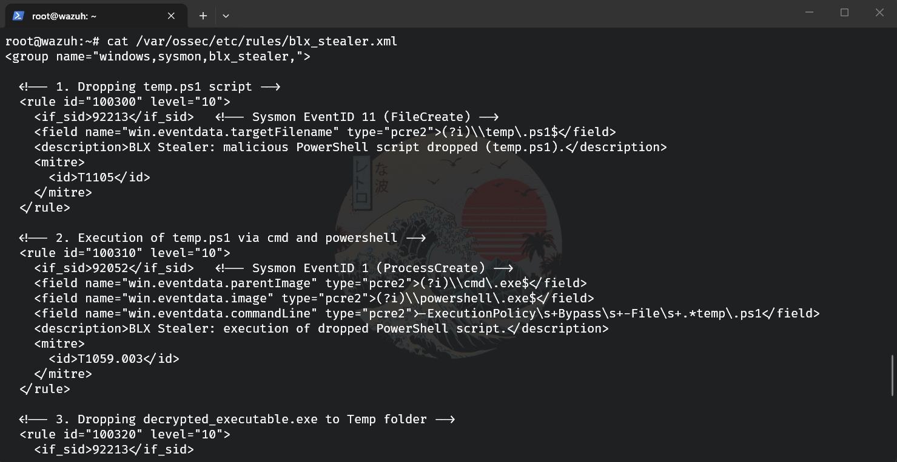

<aside>
💡

Where:

- Rule `100300` is triggered when BLX drops a rogue PowerShell script, temp.ps1 to the infected system.
- Rule `100310` is triggered when BLX executes the `temp.ps1` PowerShell script.
- Rule `100320` is triggered when BLX drops an executable, decrypted_executable.exe in the Temp folder.
- Rule `100330` is triggered when BLX copies the rogue executable to the user %Startup% folder for persistence.
- Rule `100340` (generic variant) is triggered when **any** executable file copies itself to the `%Startup%` folder – this catches self‑copying behaviour of modified BLX stealer samples that do not use the `decrypted_executable.exe` name.
</aside>

3. Restart the Wazuh manager service to apply the changes.

```bash
systemctl restart wazuh-manager
```

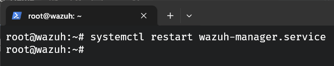

## **Visualizing alerts on the Wazuh dashboard**

The screenshot below shows the alerts generated on the Wazuh dashboard when we execute the BLX sample on the victim endpoints. Perform the following steps to view the alerts on the Wazuh dashboard.

1. Navigate to **Threat intelligence** > **Threat Hunting**.

2. Click **+ Add filter**. Then, filter for `rule.id` in the **Field** field.

3. Filter for `is one of` in the **Operator** field.

4. Filter for `100300`, `100310`, `100320`, `100330`, and `100340` in the **Values** field.

5. Click **Save**.

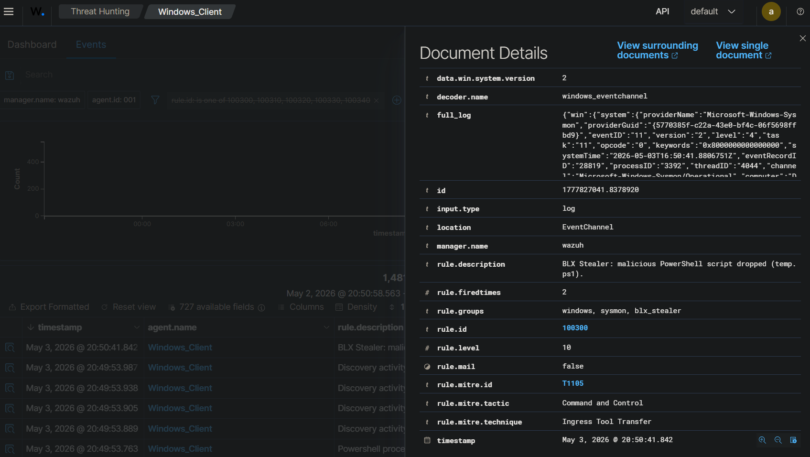

## YARA integration

## Windows endpoint

1. Launch PowerShell with administrative privilege and download YARA:

```powershell
Invoke-WebRequest -Uri https://github.com/VirusTotal/yara/releases/download/v4.5.2/yara-v4.5.2-2326-win64.zip -OutFile v4.5.2-2326-win64.zip
```

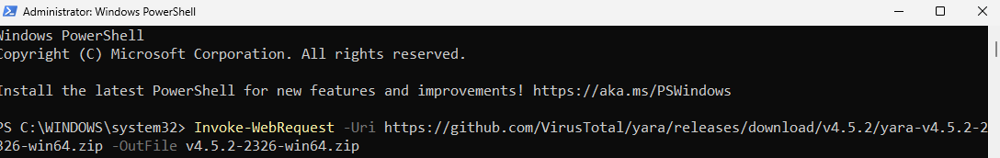

2. Extract the YARA executable:

```powershell
Expand-Archive v4.5.2-2326-win64.zip
```

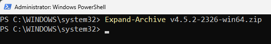

3. Create a folder called `C:\Program Files (x86)\ossec-agent\active-response\bin\yara\` and copy the YARA binary into it:

```powershell
mkdir 'C:\Program Files (x86)\ossec-agent\active-response\bin\yara\'

cp .\v4.5.2-2326-win64\yara64.exe 'C:\Program Files (x86)\ossec-agent\active-response\bin\yara\'
```

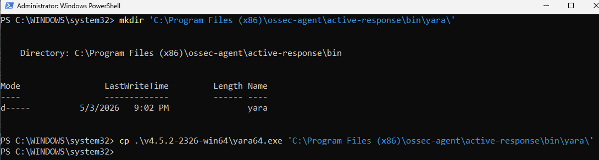

4. Using the same PowerShell terminal launched earlier, install `valhallaAPI` using the pip utility. This allows you to query thousands of handcrafted YARA and Sigma rules in different formats, filter them, and write them to disk.

```powershell
pip install valhallaAPI
```

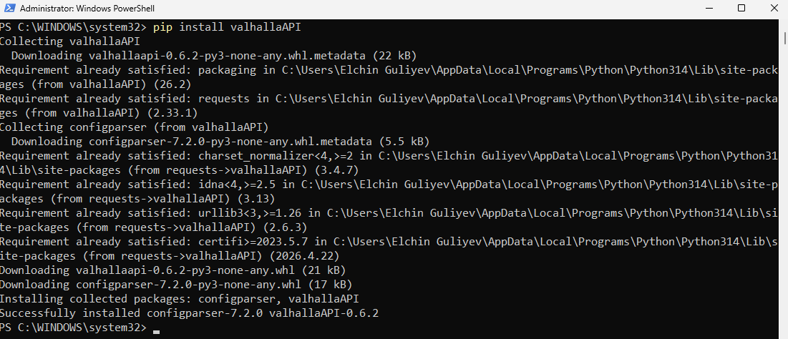

5. Create the file `download_yara_rules.py` and copy the following script into it:

```python
from valhallaAPI.valhalla import ValhallaAPI
v = ValhallaAPI(api_key="1111111111111111111111111111111111111111111111111111111111111111")
response = v.get_rules_text()

with open('yara_rules.yar', 'w') as fh:
    fh.write(response)
```

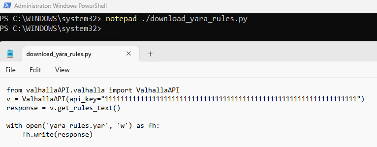

6. Download YARA rules and copy them to the `C:\Program Files (x86)\ossec-agent\active-response\bin\yara\rules\` folder:

```powershell
python download_yara_rules.py
mkdir 'C:\Program Files (x86)\ossec-agent\active-response\bin\yara\rules\'
cp yara_rules.yar 'C:\Program Files (x86)\ossec-agent\active-response\bin\yara\rules\'
```

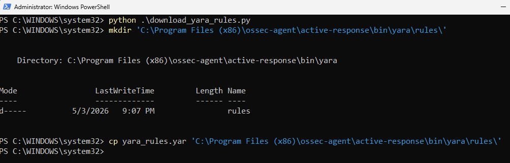

7. Edit the file `C:\Program Files (x86)\ossec-agent\active-response\bin\yara\rules\yara_rules.yar` and add the following YARA rule to detect BLX stealer:

```powershell
rule BLX_Stealer_rule {

    meta:
        description = "Detects BLX Stealer malware"
        author = "Wazuh"
        date = "2024-11-01"
        reference = "https://www.cyfirma.com/research/blx-stealer/"


    strings:
        $str0 = { 20 20 20 20 70 6f 6c 69 63 79 2e 6d 61 6e 69 66 65 73 74 2e 61 73 73 65 72 74 49 6e 74 65 67 72 69 74 79 28 6d 6f 64 75 6c 65 55 52 4c 2c 20 63 6f 6e 74 65 6e 74 29 3b }
        $str1 = { 20 20 41 72 72 61 79 50 72 6f 74 6f 74 79 70 65 53 68 69 66 74 2c }
        $str2 = { 20 20 69 66 20 28 21 73 74 61 74 65 2e 6b 65 65 70 41 6c 69 76 65 54 69 6d 65 6f 75 74 53 65 74 29 }
        $str3 = { 20 20 72 65 74 75 72 6e 20 72 65 71 75 69 72 65 28 27 74 6c 73 27 29 2e 44 45 46 41 55 4c 54 5f 43 49 50 48 45 52 53 3b }
        $str4 = { 21 47 7e 79 5f 3b }
        $str5 = { 3f 52 65 64 75 63 65 53 74 61 72 74 40 42 72 61 6e 63 68 45 6c 69 6d 69 6e 61 74 69 6f 6e 40 63 6f 6d 70 69 6c 65 72 40 69 6e 74 65 72 6e 61 6c 40 76 38 40 40 41 45 41 41 3f 41 56 52 65 64 75 63 74 69 6f 6e 40 32 33 34 40 50 45 41 56 4e 6f 64 65 40 32 33 34 40 40 5a }
        $str6 = { 40 55 56 57 48 }
        $str7 = { 41 49 5f 41 44 44 52 43 4f 4e 46 49 47 }
        $str8 = { 44 24 70 48 }
        $str9 = { 45 56 50 5f 4d 44 5f 43 54 58 5f 73 65 74 5f 75 70 64 61 74 65 5f 66 6e }
        $str10 = { 46 61 69 6c 65 64 20 74 6f 20 64 65 73 65 72 69 61 6c 69 7a 65 20 64 6f 6e 65 5f 73 74 72 69 6e 67 }
        $str11 = { 49 63 4f 70 }
        $str12 = { 54 24 48 48 }
        $str13 = { 5c 24 30 48 }
        $str14 = { 5c 24 58 48 }
        $str15 = { 64 24 40 48 }
        $str16 = { 67 65 74 73 6f 63 6b 6f 70 74 }
        $str17 = { 73 74 72 65 73 73 20 74 68 65 20 47 43 20 63 6f 6d 70 61 63 74 6f 72 20 74 6f 20 66 6c 75 73 68 20 6f 75 74 20 62 75 67 73 20 28 69 6d 70 6c 69 65 73 20 2d 2d 66 6f 72 63 65 5f 6d 61 72 6b 69 6e 67 5f 64 65 71 75 65 5f 6f 76 65 72 66 6c 6f 77 73 29 }
        $str18 = { 74 24 38 48 }
        $str19 = { 74 24 60 48 }

        $blx_stealer_network = "https://api.ipify.org" ascii wide nocase
        $blx_stealer_network1 = "https://geolocation-db.com" ascii wide nocase
        $blx_stealer_network2 = "https://discord.com/api/webhooks" ascii wide nocase

        $blx_stealer_hash1 = "8c4daf5e4ced10c3b7fd7c17c7c75a158f08867aeb6bccab6da116affa424a89"
        $blx_stealer_hash2 = "e74dac040ec85d4812b479647e11c3382ca22d6512541e8b42cf8f9fbc7b4af6"
        $blx_stealer_hash3 = "32abb4c0a362618d783c2e6ee2efb4ffe59a2a1000dadc1a6c6da95146c52881"
        $blx_stealer_hash4 = "5b46be0364d317ccd66df41bea068962d3aae032ec0c8547613ae2301efa75d6"

    condition:
        (all of ($str*) or any of ($blx_stealer_network*) or any of ($blx_stealer_hash*))

}
```

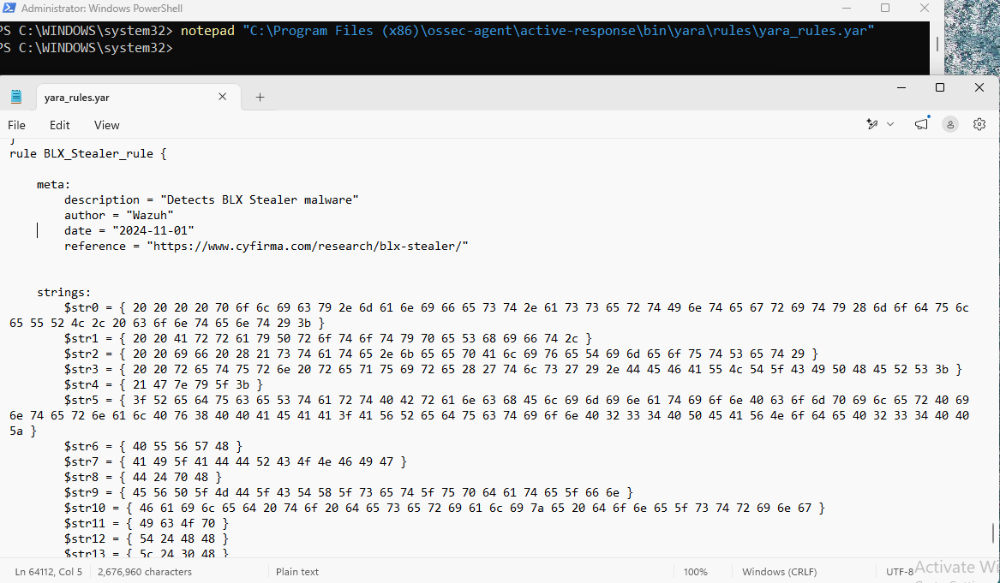

8. Edit the Wazuh agent file `C:\Program Files (x86)\ossec-agent\ossec.conf` and add the below configuration within the `<syscheck>` block to monitor the `Downloads` folders of all users in real-time:

```bash
<directories realtime="yes">C:\Users\*\Downloads</directories>
```

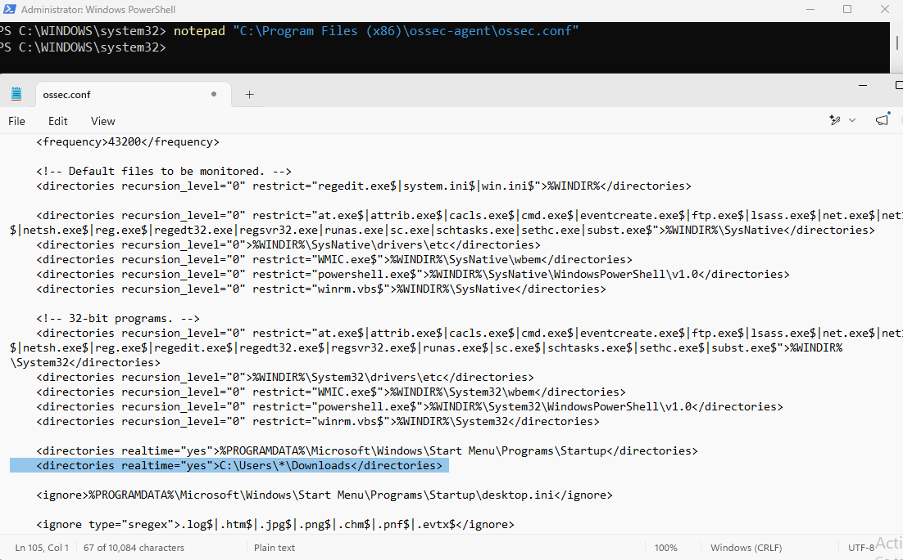

<aside>
💡

**Note**: In this situation, we monitor the `Downloads` folders of all users. However, you can configure other folders you intend to monitor.

</aside>

9. Create a batch file `yara.bat` in the `C:\Program Files (x86)\ossec-agent\active-response\bin\` folder. The Wazuh active response module uses this file to perform YARA scans for malware detection and removal:

```powershell
:: This script is meant to delete BLX Stealer and other malicious files matched by the YARA rules
@echo off
setlocal enableDelayedExpansion

:: Determine OS architecture
reg Query "HKLM\Hardware\Description\System\CentralProcessor<pre class="EnlighterJSRAW" data-enlighter-language="generic" data-enlighter-theme="" data-enlighter-highlight="" data-enlighter-linenumbers="" data-enlighter-lineoffset="" data-enlighter-title="" data-enlighter-group="">> Restart-Service -Name wazuh</pre>" | find /i "x86" > NUL && SET OS=32BIT || SET OS=64BIT
if %OS%==32BIT (
    SET log_file_path="%programfiles%\ossec-agent\active-response\active-responses.log"
)
if %OS%==64BIT (
    SET log_file_path="%programfiles(x86)%\ossec-agent\active-response\active-responses.log"
)

:: Read input from OSSEC agent
set input=
for /f "delims=" %%a in ('PowerShell -command "$logInput = Read-Host; Write-Output $logInput"') do (
    set input=%%a
)

:: File paths for operations
set json_file_path="C:\Program Files (x86)\ossec-agent\active-response\stdin.txt"
set yara_exe_path="C:\Program Files (x86)\ossec-agent\active-response\bin\yara\yara64.exe"
set yara_rules_path="C:\Program Files (x86)\ossec-agent\active-response\bin\yara\rules\yara_rules.yar"
set syscheck_file_path=
echo %input% > %json_file_path%
FOR /F "tokens=* USEBACKQ" %%F IN (`Powershell -Nop -C "(Get-Content 'C:\Program Files (x86)\ossec-agent\active-response\stdin.txt'|ConvertFrom-Json).parameters.alert.syscheck.path"`) DO (
SET syscheck_file_path=%%F
)

echo %syscheck_file_path% >> %log_file_path%

:: Perform YARA scan on the detected file
for /f "delims=" %%a in ('powershell -command "& \"%yara_exe_path%\" \"%yara_rules_path%\" \"%syscheck_file_path%\""') do (
    echo wazuh-yara: INFO - Scan result: %%a >> %log_file_path%

   :: Deleting the scanned file.
    del /f "%syscheck_file_path%"
    echo wazuh-yara: INFO - Successfully deleted: %%a >> %log_file_path%
)

exit /b
```

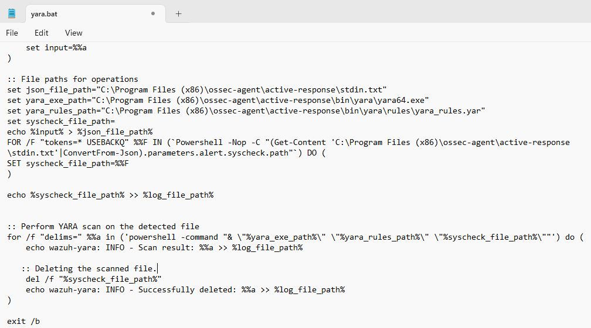

10. Restart the Wazuh agent to apply the changes:

```powershell
Restart-Service -Name Wazuh
```

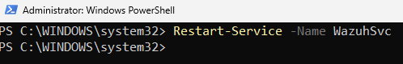

## Wazuh server

Perform the following steps to configure custom decoders, rules, and the Active Response module on the Wazuh server.

1. Edit the file `/var/ossec/etc/decoders/local_decoder.xml` and include the following decoders:

```xml
<!-- The decoders parse logs from the YARA scans -->
<decoder name="yara_decoder">
    <prematch>wazuh-yara:</prematch>
</decoder>
<decoder name="yara_decoder1">
    <parent>yara_decoder</parent>
    <regex>wazuh-yara: (\S+) - Scan result: (\S+) (\S+)</regex>
    <order>log_type, yara_rule, yara_scanned_file</order>
</decoder>

<decoder name="yara_decoder1">
    <parent>yara_decoder</parent>
    <regex>wazuh-yara: (\S+) - Successfully deleted: (\S+) (\S+)</regex>
    <order>log_type, yara_rule, yara_scanned_file</order>
</decoder>

<decoder name="yara_decoder1">
    <parent>yara_decoder</parent>
    <regex>wazuh-yara: (\S+) - Error removing threat: (\S+) (\S+)</regex>
    <order>log_type, yara_rule, yara_scanned_file</order>
</decoder>
```

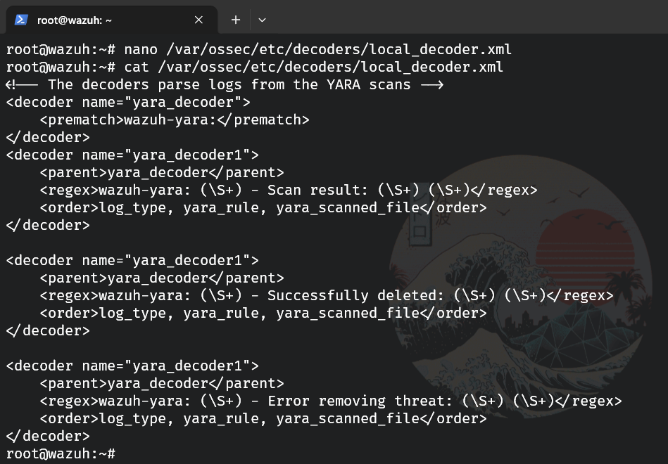

2. Edit the file `/var/ossec/etc/rules/local_rules.xml` on the Wazuh server and include the following rules:

```xml
<!-- File added to the Downloads folder -->
<group name= "syscheck,">
  <rule id="100010" level="7">
    <if_sid>550</if_sid>
    <field name="file" type="pcre2">(?i)C:\Users.+Downloads</field>
    <description>File modified in the Downloads folder.</description>
  </rule>

<!-- File modified in the Downloads folder -->
  <rule id="100011" level="7">
    <if_sid>554</if_sid>
    <field name="file" type="pcre2">(?i)C:\Users.+Downloads</field>
    <description>File added to the Downloads folder.</description>
  </rule>
</group>

<!--  Rule for the decoder (yara_decoder) -->
<group name="yara,">
  <rule id="100100" level="0">
    <decoded_as>yara_decoder</decoded_as>
    <description>Yara grouping rule</description>
  </rule>

<!--  YARA scan detects a positive match -->
  <rule id="100110" level="7">
    <if_sid>100100</if_sid>
    <match type="pcre2">wazuh-yara: INFO - Scan result: </match>
    <description>Yara scan result: File "$(yara_scanned_file)" is a positive match. Yara rule: $(yara_rule)</description>

  </rule>
  <rule id="100120" level="7">
    <if_sid>100100</if_sid>
    <match type="pcre2">wazuh-yara: INFO - Successfully deleted: </match>
    <description>Active Response: Successfully removed "$(yara_scanned_file)". YARA rule: $(yara_rule)</description>
  </rule>

<!--  Wazuh encounters an error when deleting malware with a positive match -->
  <rule id="100130" level="12">
    <if_sid>100100</if_sid>
    <match type="pcre2">wazuh-yara: INFO - Error removing threat: </match>
    <description>Active Response: Error removing "$(yara_scanned_file)". YARA rule: $(yara_rule)</description>
  </rule>
</group>
```

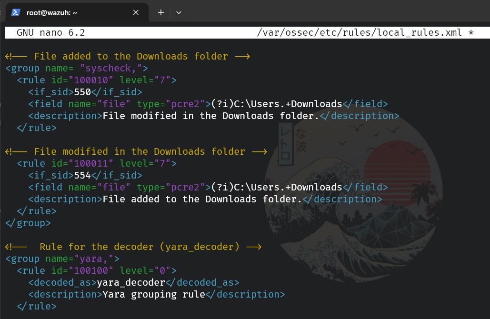

<aside>
💡

Where:

- Rule ID `100010` is triggered when a file is modified in the `Downloads` directory.
- Rule ID `100011` is triggered when a file is added to the `Downloads` directory.
- Rule ID `100100` is the base rule for detecting YARA events.
- Rule ID `100110` is triggered when YARA scans and detects a malicious file.
- Rule ID `100120` is triggered when the detected file has been successfully removed by the Wazuh active response module.
- Rule ID `100130` is triggered when the detected file is not removed successfully by Wazuh active response.
</aside>

3. Append the following configuration to the Wazuh server configuration file `/var/ossec/etc/ossec.conf`:

```xml
<ossec_config>

  <!-- The YARA batch script is executed when a file is added or modified in the Downloads folder monitored by Wazuh -->
  <command>
    <name>yara</name>
    <executable>yara.bat</executable>
    <timeout_allowed>no</timeout_allowed>
  </command>

  <active-response>
    <command>yara</command>
    <location>local</location>
    <rules_id>100010,100011</rules_id>
  </active-response>

</ossec_config>
```

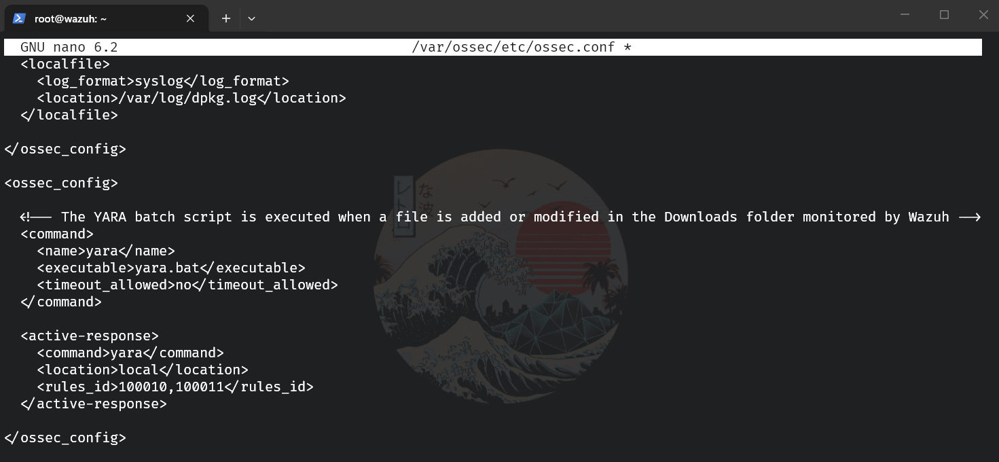

4. Restart the Wazuh manager for the changes to take effect:

```bash
systemctl restart wazuh-manager
```

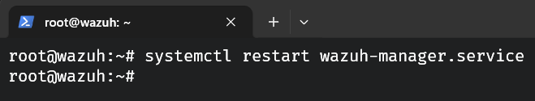

## **Visualizing alerts on the Wazuh dashboard**

The image below shows the alerts generated by the Wazuh dashboard when BLX stealer is dropped to the `Downloads` folder of the victim endpoint and executed.  Perform the following steps to view the alerts on the Wazuh dashboard.

1. Navigate to **Threat intelligence** > **Threat Hunting**.

2. Click **+ Add filter**. Then, filter for `rule.id` in the **Field** field.

3. Filter for `is one of` in the **Operator** field.

4. Filter for `553`, `100010`, `100011`, `100110`, `100120`, and `100130` in the **Values** field.

5. Click **Save**.

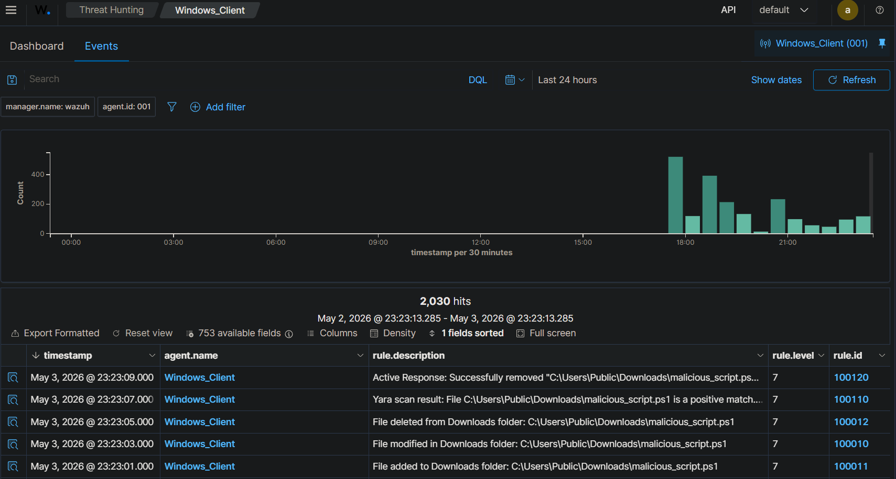
